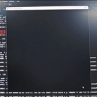

# DIJK_RASPI 🚀

may your algorithms always find the shortest path! 💡👾

English / [简体中文](docs/README_zh.md)

## Overview

This project brings Dijkstra's Algorithm to life through a Raspberry Pi and a 64x64 LED matrix.

The demo below showcases the algorithm’s visual transformation on both LED and Pygame side:

Demos:

| LED Heart | pygame heart | LED grid | pygame grid |
| --------- | ------------ | -------- | ----------- |
|  |             |          |             |

This dynamic visualization is powered by the [`rpi-rgb-led-matrix` library](https://github.com/hzeller/rpi-rgb-led-matrix/), a C-based toolkit for controlling RGB LED matrices. 
I used the Python wrapper provided by this library, and used it to control the LED array.

## Hardware 🔧

- Raspberry Pi 4B
- a 64x64 LED array from Waveshare. More specific documentation can be found [here](https://www.waveshare.net/wiki/RGB-Matrix-P2.5-64x64)

The cost of such an LED array is about 130 CNY, as a reference. It is pretty affordable for a student project.

## Software 💻

Most scripts are stored in the `/src` directory. Under the directory, 

- `dijkstra.py` is the main script that runs the underlying the Dijkstra's algorithm.

- `GraphManager.py` is responsible for loading, saving and generating graphs.

- `LEDGraphVisualizer.py` mainly uses the `rpi-rgb-led-matrix` library to visualize the graph on the LED array. The functionalities included are essentially wrapping the library and mapping the coordinates to a new coordinate with certain padding. 

- `main.py` runs the program.

`/led_lib` - files from the `rpi-rgb-led-matrix` library. Also included samples here to test if the lib is properly working on your hardware.

The lib required an installation process which is documented in the corresponding README file (just in case it doesn't work out of the box).

