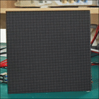
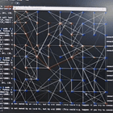

# DIJK_RASPI 🚀

千淘万漉虽辛苦，吹尽狂沙始到金。

[English](README.md) / 简体中文

## 概述

这是一个利用 64x64 LED矩阵屏和树莓派来做算法可视化的项目。

以下是一些演示：

演示：

| LED 心形 | Pygame 心形 | LED 网格 | Pygame 网格 |
| --------- | ------------ | -------- | ----------- |
|  |             |          |             |

心形图比较简单，网格图比较复杂，是自动生成的。

这个项目的硬件部分利用了 [`rpi-rgb-led-matrix` 库](https://github.com/hzeller/rpi-rgb-led-matrix/) 。
项目使用了该库提供的 Python 封装，用它来控制 LED 阵列。

## 硬件 🔧

- 树莓派 4B
- 微雪的 64x64 LED 阵列灯。更多具体文档可以在[这里](https://www.waveshare.net/wiki/RGB-Matrix-P2.5-64x64)找到。

（微雪的文档确实好看）
整个阵列屏幕大小是 160mm x 160mm，价格大概130元。

## 软件 💻

大多数脚本存储在 `/src` 目录下。这个目录下：

- `dijkstra.py` 是运行 Dijkstra 算法的主脚本。

- `GraphManager.py` 负责加载、保存和生成图。

- `LEDGraphVisualizer.py` 主要使用 `rpi-rgb-led-matrix` 库来驱动LED阵列屏幕。基本上是封装了这个库和一些坐标转换相关的功能。

- `main.py` 主程序入口。运行这个应该同时驱动 LED 以及在 Pygame 上面显示出当前的仿真。

`/led_lib` - `rpi-rgb-led-matrix` 库的文件。还包括一些示例，用于测试这个库能不能正常使用。

这个库的 python 封装需要跑一个安装过程。如果没法直接使用请按照教程安装。具体的步骤在对应的README里都有。